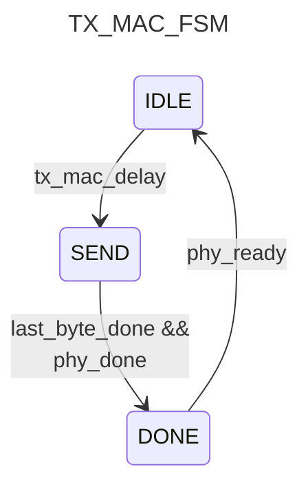
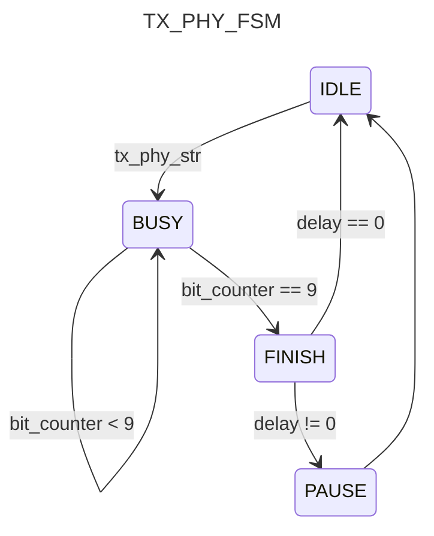

```mermaid
---
title: TX_MAC_FSM
---
stateDiagram-v2
    %% Transitions
    IDLE --> SEND:tx_mac_delay
    SEND --> DONE: last_byte_done &&<br/>phy_done
    DONE --> IDLE: phy_ready 

    %%Self Loops (Implicit in code, visualized here for clarity)

```

```mermaid
---
title: TX_PHY_FSM
---
stateDiagram-v2
    IDLE --> BUSY : tx_phy_str
    BUSY --> BUSY : bit_counter < 9
    BUSY --> FINISH : bit_counter == 9
    FINISH --> PAUSE: delay != 0
    FINISH --> IDLE: delay == 0
    PAUSE --> IDLE
```
