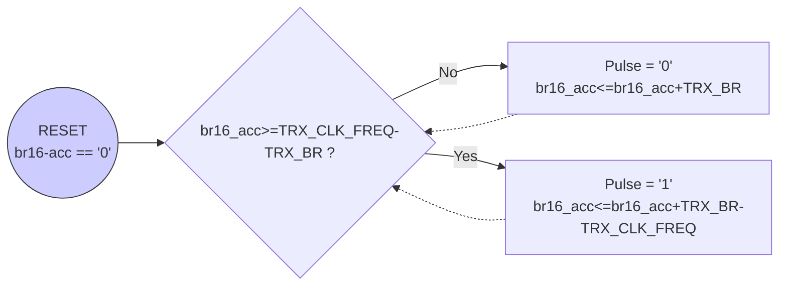

```mermaid
flowchart LR
    %% Compact Start
    Start((RESET<br>br16-acc == '0')) --> Check{"br16_acc>=TRX_CLK_FREQ-TRX_BR ?"}
    
    %% Cases
    Check -- No --> NoPulse["Pulse = '0'<br/>br16_acc<=br16_acc+TRX_BR"]
    Check -- Yes --> Pulse["Pulse = '1'<br/>br16_acc<=br16_acc+TRX_BR-TRX_CLK_FREQ"]
    
    %% Loop Back
    NoPulse & Pulse -.-> Check
    
    %% Styling
    style Start fill:#ccf,stroke:#333
```
