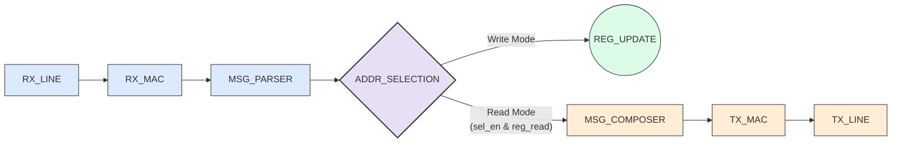

```mermaid
graph LR
    %% --- Common RX Path ---
    RxLine[RX_LINE] --> RxMac[RX_MAC]
    RxMac --> Parser[MSG_PARSER]
    Parser --> AddrSel{ADDR_SELECTION}

    %% --- Write Path (Top) ---
    AddrSel -- "Write Mode" --> RegUpd((REG_UPDATE))

    %% --- Read Path (Bottom) ---
    AddrSel -- "Read Mode<br/>(sel_en & reg_read)" --> Composer[MSG_COMPOSER]
    Composer --> TxMac[TX_MAC]
    TxMac --> TxLine[TX_LINE]

    %% --- Styling for clarity ---
    %% RX Path (Blue-ish)
    style RxLine fill:#dbeafe,stroke:#333
    style RxMac fill:#dbeafe,stroke:#333
    style Parser fill:#dbeafe,stroke:#333
    
    %% Decision Point (Purple)
    style AddrSel fill:#e8dff5,stroke:#333,stroke-width:2px
    
    %% Write End (Green)
    style RegUpd fill:#dcfce7,stroke:#333
    
    %% TX Path (Orange-ish)
    style Composer fill:#ffedd5,stroke:#333
    style TxMac fill:#ffedd5,stroke:#333
    style TxLine fill:#ffedd5,stroke:#333
```