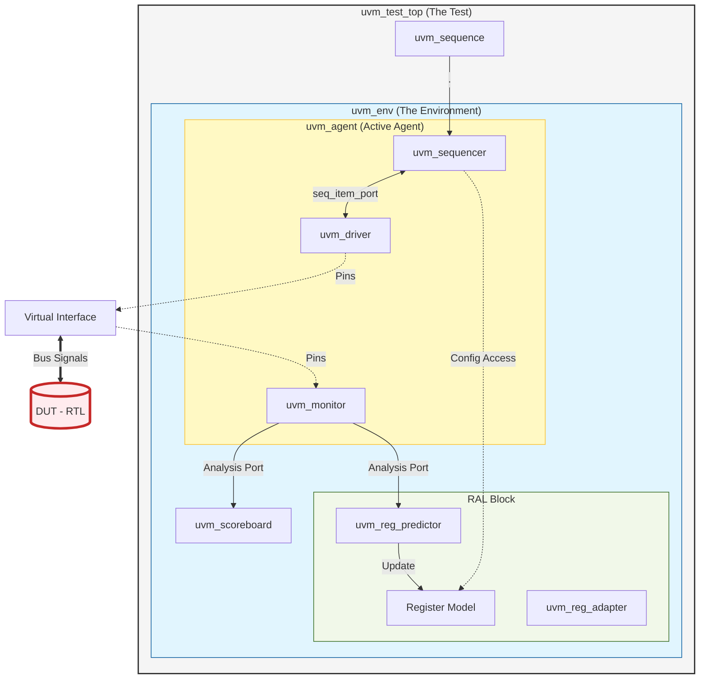

```mermaid
graph TB
    subgraph TEST ["uvm_test_top (The Test)"]
        SEQ[uvm_sequence]
        subgraph ENV ["uvm_env (The Environment)"]
            
            subgraph AGENT ["uvm_agent (Active Agent)"]
                SQNR[uvm_sequencer]
                DRV[uvm_driver]
                MON[uvm_monitor]
                
                SQNR <--> |seq_item_port| DRV
            end

            SB[uvm_scoreboard]
            
            subgraph RAL ["RAL Block"]
                RM[Register Model]
                PRED[uvm_reg_predictor]
                ADAPT[uvm_reg_adapter]
            end

        end
    end

    %% Hardware Level
    DUT[(DUT - RTL)]
    IF[Virtual Interface]

    %% Connections
    DRV -.-> |Pins| IF
    IF -.-> |Pins| MON
    IF <==> |Bus Signals| DUT
    
    MON --> |Analysis Port| SB
    MON --> |Analysis Port| PRED
    PRED --> |Update| RM
    
    %% Sequence Flow
    SEQ --.--> SQNR
    SQNR -.-> |Config Access| RM

    %% Styling using IDs
    style TEST fill:#f5f5f5,stroke:#333,stroke-width:2px
    style ENV fill:#e1f5fe,stroke:#01579b
    style AGENT fill:#fff9c4,stroke:#fbc02d
    style RAL fill:#f1f8e9,stroke:#33691e
    style DUT fill:#ffebee,stroke:#c62828,stroke-width:4px
```